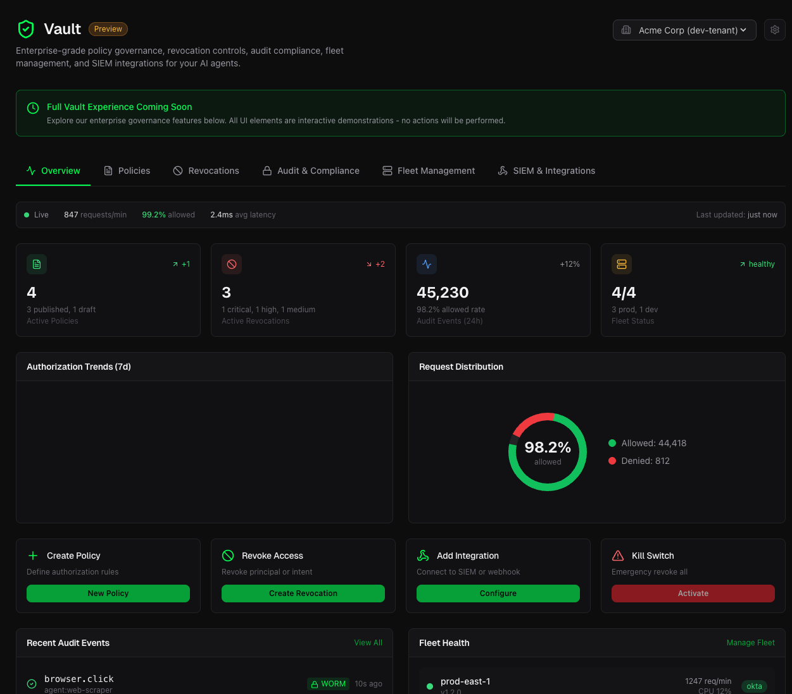
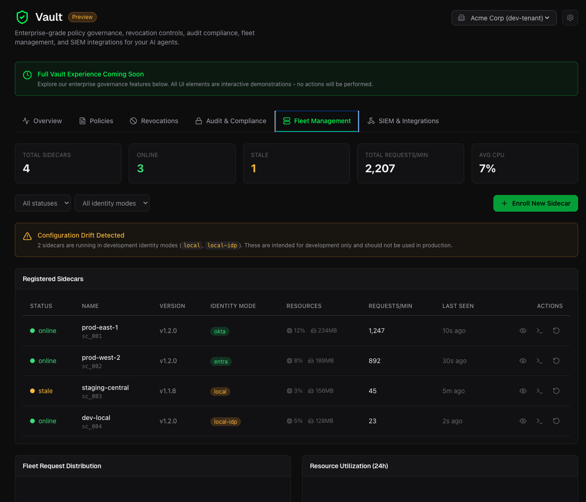
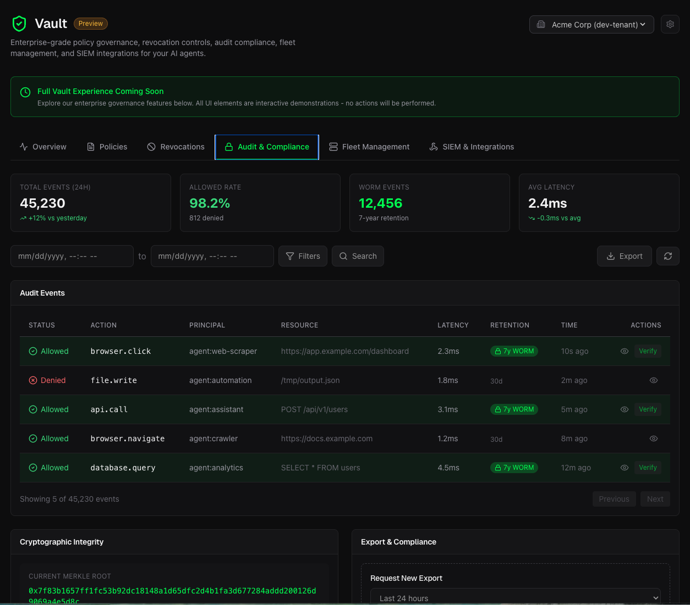
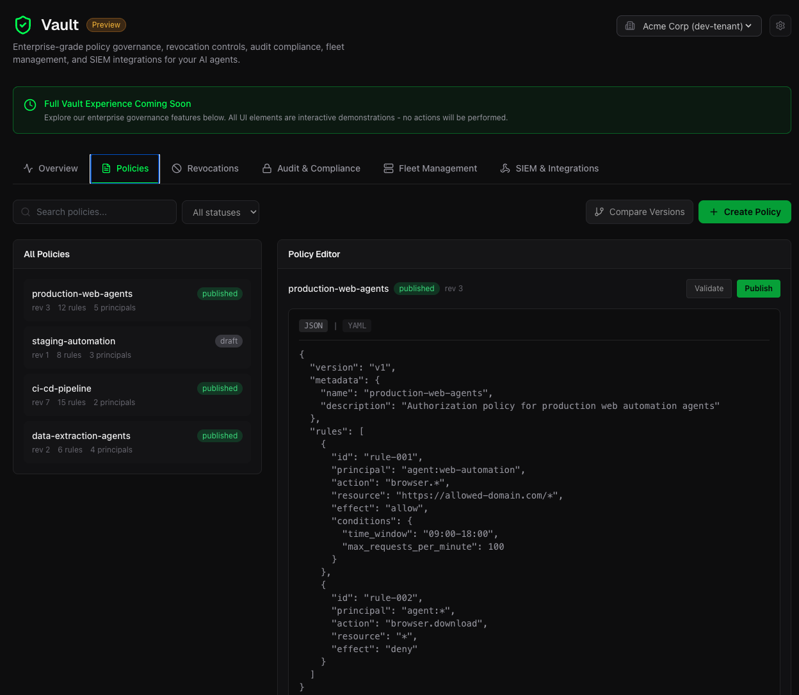
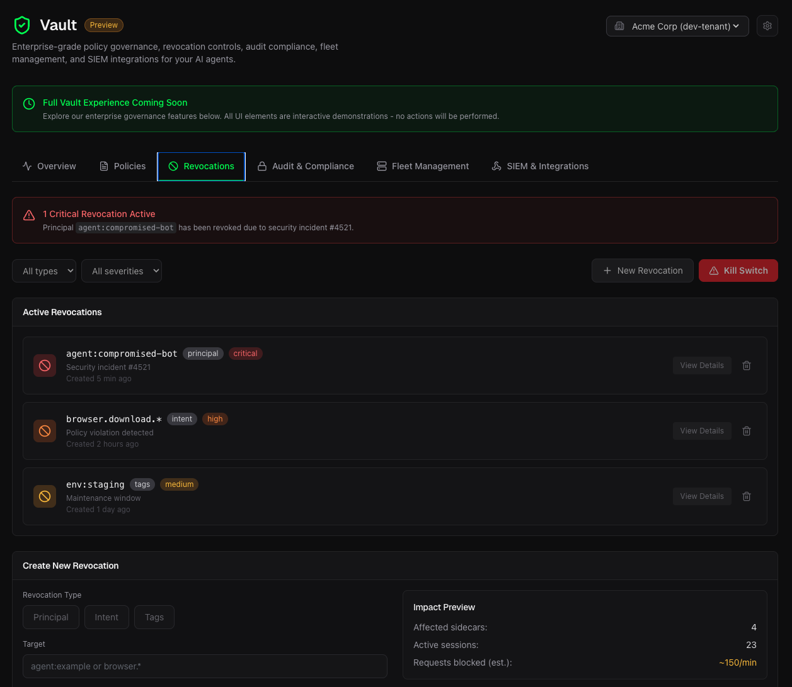
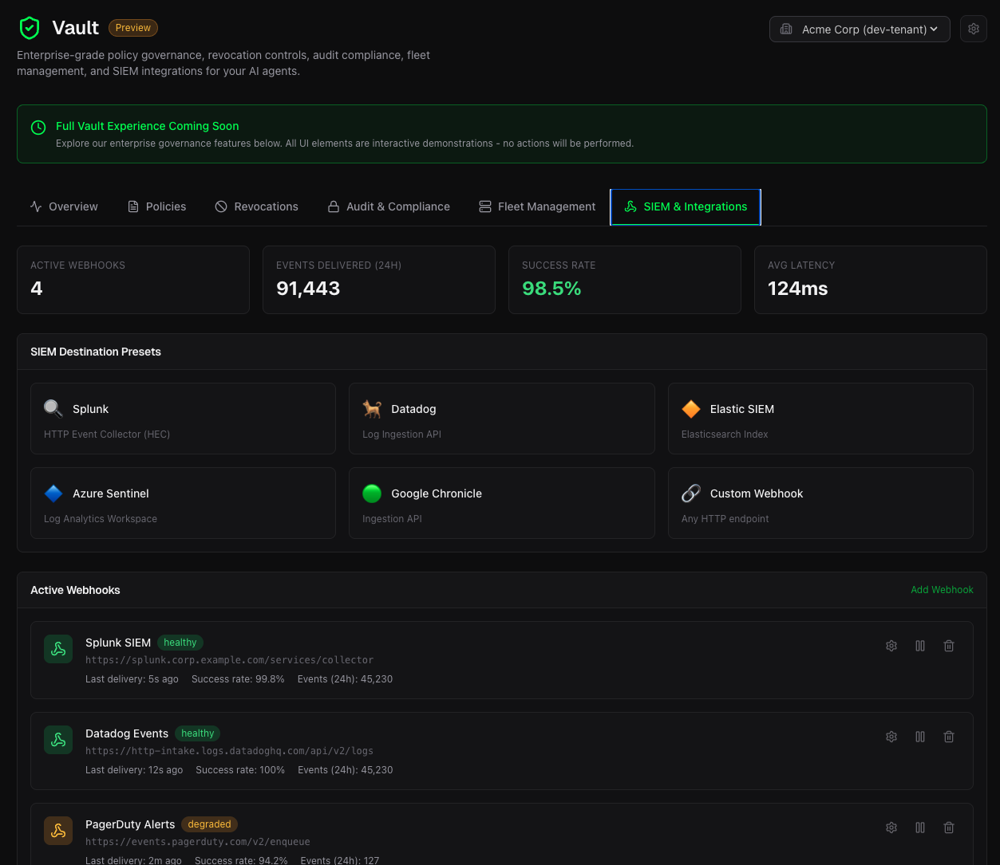

# @predicatesystems/temporal

Temporal.io Worker Interceptor for Predicate Authority Zero-Trust authorization.

<video src="https://github.com/user-attachments/assets/511b6d38-90ab-413e-8af6-a89fc459eea5" autoplay loop muted playsinline></video>

**Powered by [predicate-authority](https://github.com/PredicateSystems/predicate-authority) SDK:** [Python](https://github.com/PredicateSystems/predicate-authority) | [TypeScript](https://github.com/PredicateSystems/predicate-authority-ts)

This package provides a pre-execution security gate for all Temporal Activities, enforcing cryptographic authorization mandates before any activity code runs.

## Demo: Hack vs Fix

See Predicate Authority block dangerous Temporal activities in real-time. The Python demo works with both SDK implementations:

```bash
git clone https://github.com/PredicateSystems/predicate-temporal-python
cd predicate-temporal-python/examples/demo
./start-demo-native.sh
```

**Requirements:** Python 3.11+, [Temporal CLI](https://docs.temporal.io/cli#install)

The demo shows 4 scenarios:
1. **Legitimate order processing** → ✅ ALLOWED
2. **Delete order attack** → ❌ BLOCKED by `deny-delete-operations`
3. **Admin override attack** → ❌ BLOCKED by `deny-admin-operations`
4. **Drop database attack** → ❌ BLOCKED by `deny-drop-operations`

## Sidecar Prerequisite

This package requires the **Predicate Authority Sidecar** daemon to be running. The sidecar is a high-performance Rust binary that handles policy evaluation and mandate signing locally—no data leaves your infrastructure.

| Resource | Link |
|----------|------|
| Sidecar Repository | [predicate-authority-sidecar](https://github.com/PredicateSystems/predicate-authority-sidecar) |
| Download Binaries | [Latest Releases](https://github.com/PredicateSystems/predicate-authority-sidecar/releases) |
| License | MIT / Apache 2.0 |

### Quick Sidecar Setup

**Option A: Docker (Recommended)**
```bash
docker run -d -p 8787:8787 ghcr.io/predicatesystems/predicate-authorityd:latest
```

**Option B: Download Binary**
```bash
# macOS (Apple Silicon)
curl -fsSL https://github.com/PredicateSystems/predicate-authority-sidecar/releases/latest/download/predicate-authorityd-darwin-arm64.tar.gz | tar -xz
chmod +x predicate-authorityd
./predicate-authorityd --port 8787 --policy-file policy.json

# Linux x64
curl -fsSL https://github.com/PredicateSystems/predicate-authority-sidecar/releases/latest/download/predicate-authorityd-linux-x64.tar.gz | tar -xz
chmod +x predicate-authorityd
./predicate-authorityd --port 8787 --policy-file policy.json
```

See [all platform binaries](https://github.com/PredicateSystems/predicate-authority-sidecar/releases) for Linux ARM64, macOS Intel, and Windows.

**Verify it's running:**
```bash
curl http://localhost:8787/health
# {"status":"ok"}
```

## Installation

```bash
npm install @predicatesystems/temporal
# or
yarn add @predicatesystems/temporal
# or
pnpm add @predicatesystems/temporal
```

## Quick Start

```typescript
import { Worker } from "@temporalio/worker";
import { AuthorityClient } from "@predicatesystems/authority";
import { createPredicateInterceptors } from "@predicatesystems/temporal";

// Initialize the Predicate Authority client
const authorityClient = new AuthorityClient({
  baseUrl: "http://127.0.0.1:8787",
});

// Create interceptors
const interceptors = createPredicateInterceptors({
  authorityClient,
  principal: "temporal-worker",
});

// Create worker with the interceptors
const worker = await Worker.create({
  connection,
  namespace: "default",
  taskQueue: "my-task-queue",
  workflowsPath: require.resolve("./workflows"),
  activities,
  interceptors,
});
```

## How It Works

The interceptor sits in the Temporal activity execution pipeline:

1. Temporal dispatches an activity to your worker
2. **Before** the activity code runs, the interceptor extracts:
   - Activity type (action)
   - Activity arguments (context)
3. The interceptor calls `AuthorityClient.authorize()` to request a mandate
4. If **denied**: throws `PredicateAuthorizationError` - activity never executes
5. If **approved**: activity proceeds normally

This ensures that no untrusted code or payload reaches your OS until it has been cryptographically authorized.

## Configuration

### Interceptor Options

```typescript
import { createPredicateInterceptors } from "@predicatesystems/temporal";

const interceptors = createPredicateInterceptors({
  // Required: The Predicate Authority client
  authorityClient: new AuthorityClient({ baseUrl: "http://127.0.0.1:8787" }),

  // Optional: Principal ID (default: "temporal-worker")
  principal: "my-worker",

  // Optional: Tenant ID for multi-tenant setups
  tenantId: "tenant-123",

  // Optional: Session ID for request correlation
  sessionId: "session-456",

  // Optional: Custom resource identifier (default: "temporal:activity")
  resource: "temporal:my-queue",
});
```

### Policy File

Create a policy file for the Predicate Authority daemon:

```json
{
  "rules": [
    {
      "name": "allow-safe-activities",
      "effect": "allow",
      "principals": ["temporal-worker"],
      "actions": ["processOrder", "sendNotification"],
      "resources": ["*"]
    },
    {
      "name": "deny-dangerous-activities",
      "effect": "deny",
      "principals": ["*"],
      "actions": ["delete*", "admin*"],
      "resources": ["*"]
    }
  ]
}
```

## API Reference

### `createPredicateInterceptors(options)`

Creates the interceptor configuration object for `Worker.create()`.

**Parameters:**

- `options.authorityClient` (required): `AuthorityClient` - The Predicate Authority client instance
- `options.principal` (optional): `string` - Principal ID (default: `"temporal-worker"`)
- `options.tenantId` (optional): `string` - Tenant ID for multi-tenant setups
- `options.sessionId` (optional): `string` - Session ID for request correlation
- `options.resource` (optional): `string` - Resource identifier (default: `"temporal:activity"`)

**Returns:** `WorkerInterceptors` - The interceptor configuration for Temporal Worker

### `PredicateActivityInterceptor`

The activity interceptor class. Usually you don't need to instantiate this directly - use `createPredicateInterceptors()` instead.

### `PredicateAuthorizationError`

Custom error thrown when authorization is denied.

```typescript
import { PredicateAuthorizationError } from "@predicatesystems/temporal";

try {
  await workflow.executeActivity("dangerousActivity", args);
} catch (error) {
  if (error instanceof PredicateAuthorizationError) {
    console.log(`Denied: ${error.reason}`);
    console.log(`Violated rule: ${error.violatedRule}`);
  }
}
```

## Error Handling

When authorization is denied, the interceptor throws a `PredicateAuthorizationError`:

```typescript
import { ApplicationFailure } from "@temporalio/workflow";

try {
  await workflow.executeActivity("sensitiveActivity", args, {
    startToCloseTimeout: "30s",
  });
} catch (error) {
  if (error instanceof ApplicationFailure) {
    // Check if it's a Predicate denial
    if (error.message.includes("Predicate Zero-Trust Denial")) {
      // Handle authorization denial
      console.log("Activity was blocked by security policy");
    }
  }
}
```

## Development

```bash
# Install dependencies
npm install

# Build
npm run build

# Run tests
npm test

# Type checking
npm run typecheck

# Linting
npm run lint
```

## Audit Vault and Control Plane

The Predicate sidecar and SDKs are 100% open-source and free for local development and single-agent deployments.

However, when deploying a fleet of AI agents in regulated environments (FinTech, Healthcare, Security), security teams cannot manage scattered YAML files or local SQLite databases. For production fleets, we offer the **Predicate Control Plane** and **Audit Vault**.

<table>
<tr>
<td width="50%" align="center">

<br><em>Real-time dashboard with authorization metrics</em>
</td>
<td width="50%" align="center">

<br><em>Fleet management across all sidecars</em>
</td>
</tr>
<tr>
<td width="50%" align="center">

<br><em>WORM-ready audit ledger with 7-year retention</em>
</td>
<td width="50%" align="center">

<br><em>Centralized policy editor</em>
</td>
</tr>
<tr>
<td width="50%" align="center">

<br><em>Global kill-switches and revocations</em>
</td>
<td width="50%" align="center">

<br><em>SIEM integrations (Splunk, Datadog, Sentinel)</em>
</td>
</tr>
</table>

**Control Plane Features:**

* **Global Kill-Switches:** Instantly revoke a compromised agent's `principal` or `intent_hash`. The revocation syncs to all connected sidecars in milliseconds.
* **Immutable Audit Vault (WORM):** Every authorized mandate and blocked action is cryptographically signed and stored in a 7-year, WORM-ready ledger. Prove to SOC2 auditors exactly *what* your agents did and *why* they were authorized.
* **Fleet Management:** Manage your fleet of agents with total control
* **SIEM Integrations:** Stream authorization events and security alerts directly to Datadog, Splunk, or your existing security dashboard.
* **Centralized Policy Management:** Update and publish access policies across your entire fleet without redeploying agent code.

**[Learn more about Predicate Systems](https://www.predicatesystems.ai)**

---

## License

MIT
